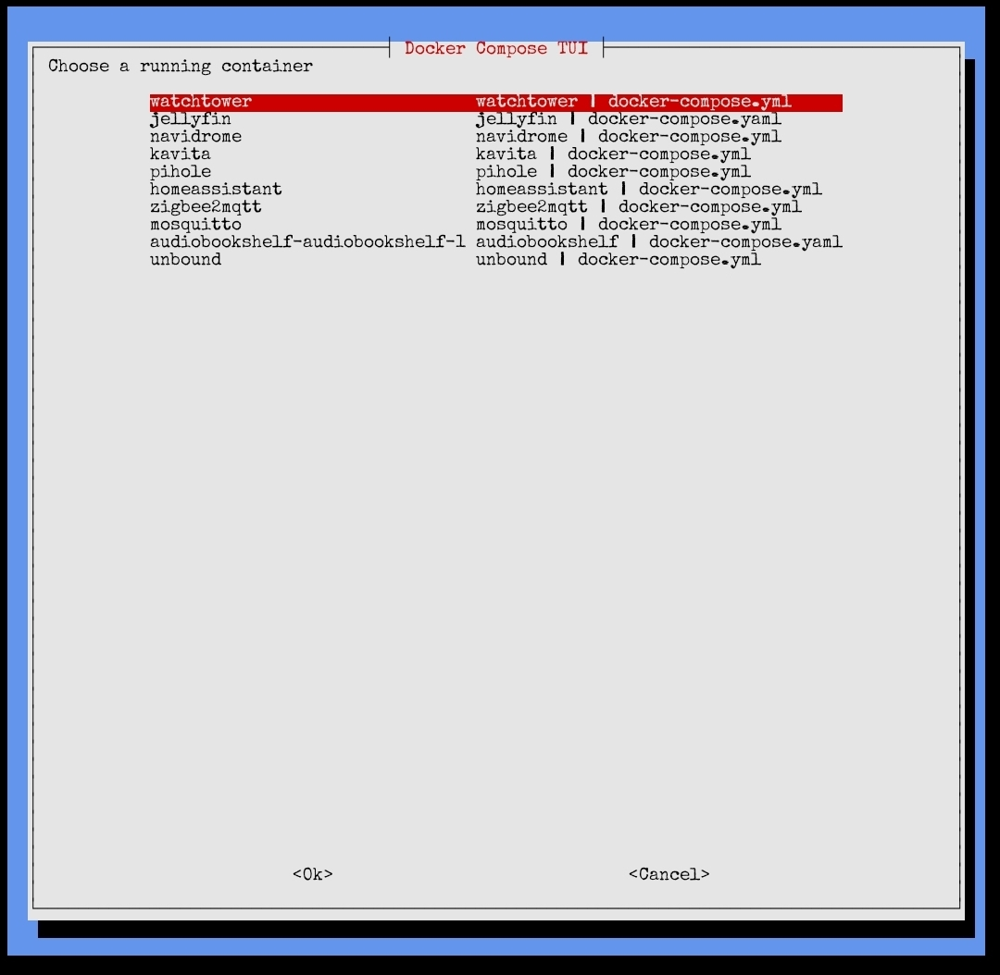

# Docker Compose TUI

A terminal-based Docker Compose helper for SSH sessions. It provides a `whiptail`-driven menu for inspecting running Compose-managed containers, locating their Compose files, viewing remote version tags from Docker Hub, reverting to an older version tag, and switching a service back to `:latest` when needed.



## What it does

This script is designed for Docker hosts where services are managed with Docker Compose and containers expose Compose metadata such as `com.docker.compose.project`, `com.docker.compose.service`, and `com.docker.compose.project.config_files` labels.The TUI uses those labels to discover which Compose file controls each running container and then performs targeted edits against the correct service entry instead of assuming the container name and service name are always identical.

Core actions include:

- Show the Compose file path for a selected running container.
- Show the current image reference in use by that container.
- Show version-like remote tags from Docker Hub in a scrollable textbox; `whiptail --textbox` expects a real file path, so the script writes the tag list to a temporary file before displaying it.
- Revert a service to a selected version tag from Docker Hub.
- Revert a service to the previous semver-like tag when that can be determined automatically, with a manual picker fallback.
- Set a service image back to `repo:latest`; Docker treats omitted tags as `latest`, but using `:latest` explicitly is usually clearer in Compose files.

## Requirements

### Software requirements

The script expects the following commands to be installed and available in `PATH`:

- `bash`
- `docker`
- `docker compose`
- `whiptail`
- `curl`
- `jq`
- `awk`
- `mktemp`
- `tput`
- `sudo`

`whiptail` is the terminal dialog frontend used to build the menu interface over SSH.`jq` is required to parse Docker Hub tag API responses.Docker object labels are used to locate Compose metadata from running containers.

### Operating assumptions

This tool is best suited to:

- Debian or Ubuntu-like systems where `whiptail`, `jq`, and Docker are easy to install from standard repositories.
- Hosts where services are launched with Docker Compose rather than raw `docker run`, because the script relies on Compose labels to locate project and file metadata.
- Interactive SSH sessions with a working terminal size, because the TUI uses `tput` to scale menu dimensions to the current terminal.

### Permission model

The script is intended to be run as a normal user with `sudo` access, not as a permanently root shell. Commands that need elevated privileges, such as copying Compose files back into protected locations or running `docker compose` operations, are elevated individually with `sudo`.This approach is safer and cleaner than running the whole TUI as root by default.

## Dependencies and installation

### Debian 12 package install

Install the main dependencies with:

```bash
sudo apt update
sudo apt install -y whiptail jq curl docker.io docker-compose-plugin
```

Depending on the host, Docker may already be installed separately. `whiptail` provides the text UI and `jq` parses JSON from Docker Hub.

### Script installation

Place the script in a local admin path such as `/usr/local/bin`, which is the conventional location for locally installed executables rather than distro-managed binaries.

```bash
sudo nano /usr/local/bin/docker_compose_tui
sudo chmod +x /usr/local/bin/docker_compose_tui
bash -n /usr/local/bin/docker_compose_tui
```

Run it with:

```bash
/usr/local/bin/docker_compose_tui
```

### Optional convenience alias

Add an alias or shell function in `~/.bashrc` if desired:

```bash
alias dctui='/usr/local/bin/docker_compose_tui'
```

Reload the shell:

```bash
source ~/.bashrc
```

## How the wizard works

### 1. Container discovery

The main menu reads running container names with:

```bash
docker ps --format '{{.Names}}'
```

For each running container, the script inspects Docker labels such as:

- `com.docker.compose.project`
- `com.docker.compose.service`
- `com.docker.compose.project.working_dir`
- `com.docker.compose.project.config_files`

These labels are used to identify the Compose project, service name, and the actual Compose file path that launched the container.

### 2. Compose-aware service targeting

When an action is selected, the script edits the matching service inside the discovered Compose file rather than guessing based on the container name. This matters because Compose container names and service names are related but not always a safe one-to-one assumption in custom setups.

### 3. Remote tag lookup

The script calls the Docker Hub tag API and parses tag names using `jq`.It filters for version-like tags with a regex and sorts them with version sorting so the menu can present sensible rollback candidates.

### 4. Safe file editing flow

When changing a service image, the script:

1. Creates a timestamped backup of the Compose file.
2. Writes the modified file to a temporary file as the current user.
3. Copies the temp file back into place with `sudo` only where required.
4. Validates the resulting Compose file with `docker compose config`.
5. Pulls and recreates only the selected service.

Using a user-owned temp file avoids the earlier `sudo tee` permission issue that can happen with temporary files in `/tmp` and mixed ownership or sticky-bit protection rules.

## Menu actions

### Show compose path

Displays the full Compose file path discovered from the running container’s Compose labels.

### Show image reference

Displays the current image reference returned by Docker for the selected container.

### Show remote version tags

Queries Docker Hub for version-like tags and displays them in a `whiptail --textbox` view. The implementation writes the output to a temporary file first because `whiptail --textbox` works reliably with real files rather than process substitution streams.

### Pick rollback tag

Lets the user manually choose a remote version tag from Docker Hub and then updates the service image line in the Compose file to that exact tag.

### Auto previous / picker

Attempts to detect the previous version tag from the current semver-like tag. If the current image is on `latest`, `stable`, or another non-versioned reference, it falls back to a manual tag picker because `latest` is only a tag name, not a trustworthy marker for “the previous real release.”

### Set image back to latest

Changes the selected service image back to `repo:latest`. Docker treats an omitted tag as `latest`, but the script uses `:latest` explicitly so the Compose file is easy to read later.

## Important limitations

### Docker Hub tag quality

The rollback logic works best on images that publish clean numeric version tags such as `1.2.3` or `10.10.7`.Repositories that mainly use tags like `latest`, `stable`, `beta`, or other non-semantic schemes may require manual selection rather than automatic previous-version detection.

### Compose-managed containers only

If a container was launched with plain `docker run`, the Compose labels may be missing, and the TUI will not be able to discover a Compose file path automatically.

### `latest` is not a guarantee of safety

Setting a service back to `:latest` hands control back to whatever image the publisher currently points that tag at. That may be newer, but it is not always the safest or most stable build.

## Example workflow

### Roll back a broken image

1. Launch the TUI.
2. Select the running container.
3. Choose `show_tags` if you want to inspect available remote version tags first.
4. Choose `revert_pick` to select a known-good version, or `revert_prev` to attempt the previous version automatically.
5. Confirm the change.
6. The script backs up the Compose file, edits the `image:` line, validates the Compose config, and recreates only that one service.

### Put a service back on the moving tag

1. Launch the TUI.
2. Select the container.
3. Choose `set_latest`.
4. Confirm the change.
5. The script updates the Compose file to `repo:latest`, validates it, and recreates the service.

## Troubleshooting

### `show_tags` does not display anything

Make sure `jq` and `curl` are installed and that the host can reach Docker Hub.If `whiptail --textbox` was previously wired to process substitution instead of a real file, it may fail; the current implementation fixes this by writing the tag output to a temporary file first.

### `Permission denied` with temp files

If you saw errors involving `tee` and `/tmp`, the likely cause was trying to write a user-owned temp file through `sudo tee`. The corrected script writes the temp file as the current user and only uses `sudo` for privileged copy or Compose operations.

### Main menu looks cramped or misaligned

If the container list looks messy, reduce the amount of text in the second menu column. Short descriptions such as `service | composefile.yml` are usually enough, and `whiptail` layouts are easier to read when descriptions are short.

### The wrong script is running

If interface changes do not appear after editing, verify which file is being executed:

```bash
which docker_compose_tui
ls -l /usr/local/bin/docker_compose_tui /bin/docker_compose_tui.sh 2>/dev/null
```

### Compose validation fails

If `docker compose config` fails after an edit, the script should restore the backup copy of the Compose file before exiting. This protects against leaving a broken file in place after an unsuccessful rewrite.

## Security notes

This tool edits Compose files and runs `docker compose pull` and `docker compose up -d` for selected services, so it should only be used by trusted administrators on hosts they control. Docker labels are metadata attached to Docker objects and are appropriate for administrative discovery workflows like this one, but the ability to edit deployment files and recreate containers is still a privileged action.

## Recommended companion setup

This TUI pairs well with:

- Watchtower for automatic updates of selected low-risk services, especially when combined with manual rollback control in the TUI.
- Compose-managed homelab services where quick rollback is more important than a full CI/CD pipeline.
- SSH administration sessions where a terminal UI is more convenient than repeatedly editing YAML by hand.

## Quick start summary

```bash
sudo apt update
sudo apt install -y whiptail jq curl docker.io docker-compose-plugin
sudo nano /usr/local/bin/docker_compose_tui
sudo chmod +x /usr/local/bin/docker_compose_tui
bash -n /usr/local/bin/docker_compose_tui
/usr/local/bin/docker_compose_tui
```

Once installed, the wizard gives a practical way to inspect Compose-managed containers, check remote tags, pin a service to an older version, and move it back to `:latest` when ready.